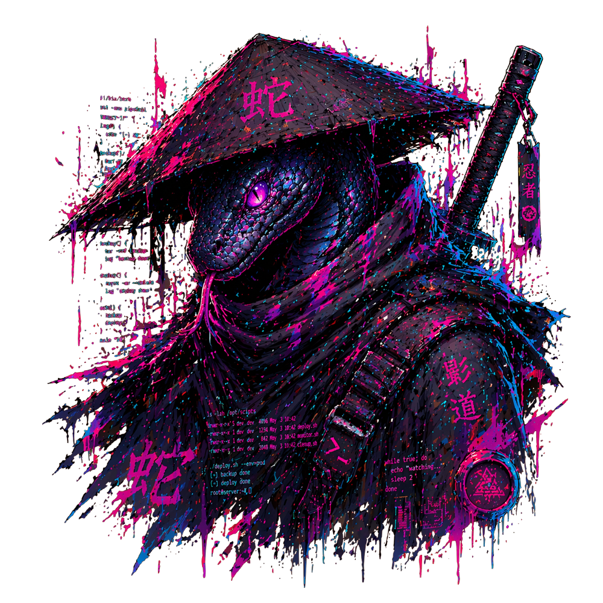

    
    <h3>karakurtOS</h3>
    

        bspwm-dotfile 
        console-like system
    

     

 

 - OS: [**Arch**](https://www.google.com/search?q=Arch)
 - WM: [**BSPWM**](https://www.google.com/search?q=bspwm)
 - Bar: [**Polybar**](https://www.google.com/search?q=Polybar)
 - Shell: [**Zsh**](https://www.google.com/search?q=Zsh)
 - Terminal: [**Kitty**](https://www.google.com/search?q=Kitty+terminal)
 - Compositor: [**Picom**](https://www.google.com/search?q=Picom)
 - File manager: [**yazi**](https://www.google.com/search?q=yazi+file+manager)
 - App Launcher: [**Rofi**](https://www.google.com/search?q=Rofi)

 

 
    <h4>System Control via Hotkeys</h4>
      

    <h4>Easy System Customization</h4>
    <video src="./readme/img/color.webm" autoplay loop muted playsinline width="700"></video>

