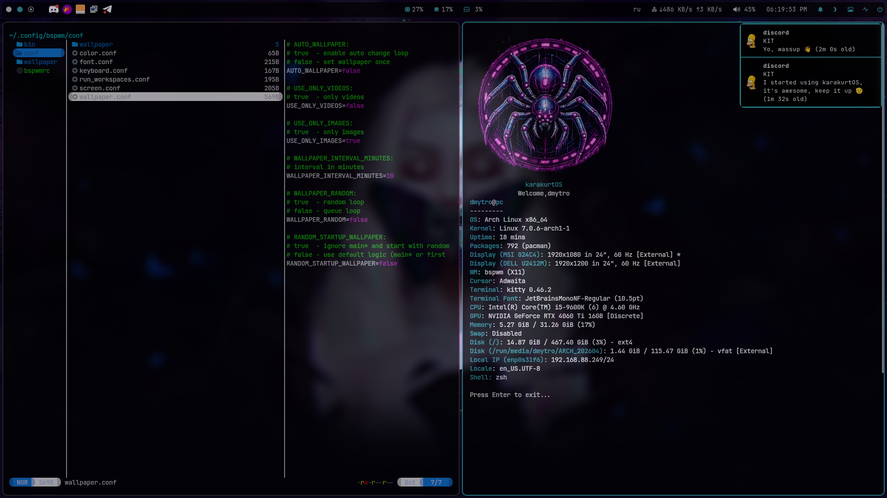

    
    <h3>karakurtOS</h3>
    

        bspwm-dotfile 
        console-like system
    

     

| Component | System Info |
| :--- | ---: |
| OS | Arch |
| WM | BSPWM |
| Bar | Polybar |
| Shell | Zsh |
| Terminal | Kitty |
| Compositor | Picom |
| File manager | yazi |
| App Launcher | Rofi |

 
    <h4>System Control via Hotkeys</h4>
      

